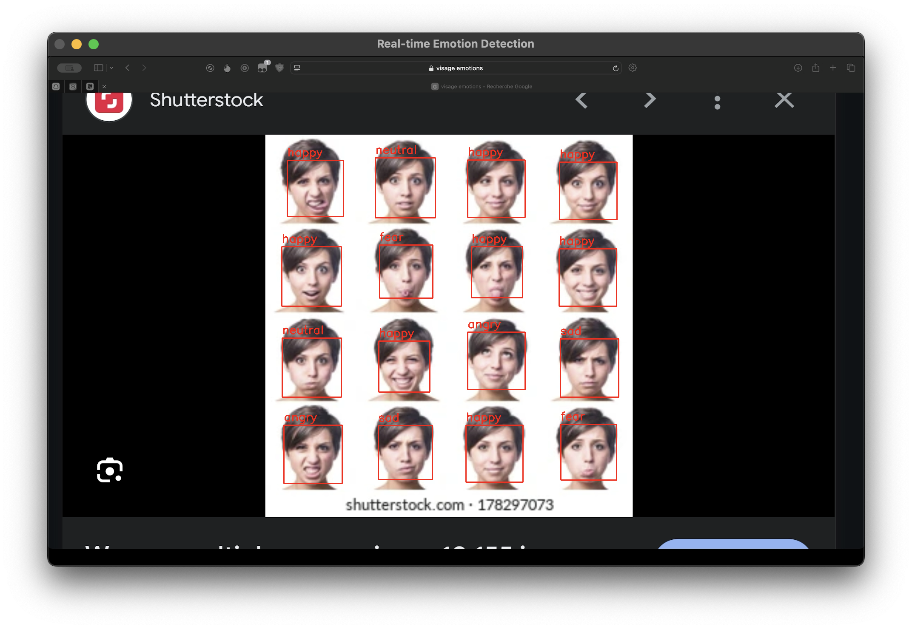
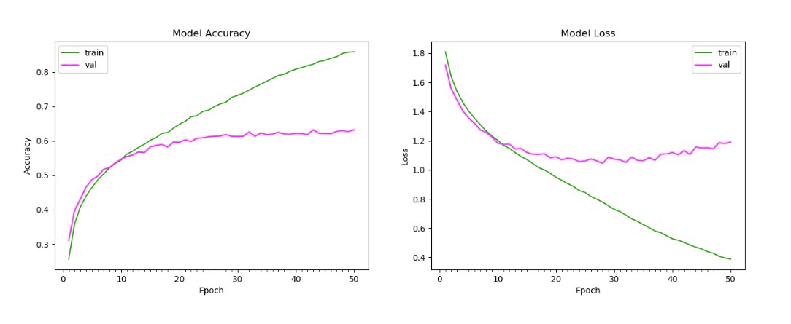

# Real-Time Emotion Detection  

## Project Overview  

### Main Objectives  
This project focuses on developing a system capable of detecting emotions in real-time from facial expressions using deep learning techniques. By leveraging advanced image processing and pre-trained models, the system aims to classify emotions such as happiness, sadness, anger, and surprise in a seamless and efficient manner.  

### Achieved Results  
- **Real-Time Emotion Detection**: Successfully implemented a system that processes live video feeds to detect and label emotions from facial expressions.  
- **Robust Framework**: Built using Python, OpenCV, and the DeepFace library, the system is designed to integrate into applications requiring real-time feedback, such as human-computer interaction (HCI), virtual environments, and assistive technologies.  

---

## Source Code  

The main implementation is contained within **emotion_detection.py**, a Python script that uses OpenCV for video capture and DeepFace for emotion analysis. The code is structured for clarity and ease of use, making it accessible for further development or integration.  

---

## Performance Metrics  

### Accuracy  
The system utilizes the DeepFace library, which has been trained on high-quality, publicly available datasets. This ensures reliable classification for a range of facial expressions.  

### Real-Time Processing  
The integration of OpenCV ensures that the system maintains real-time processing speeds, offering smooth performance on standard hardware setups.  

### Limitations  
- **Lighting Conditions**: The model's accuracy may drop in low-light environments.  
- **Partial Occlusions**: Faces that are partially obscured (e.g., with masks or glasses) may impact emotion detection.  
- **Limited Multi-Face Support**: While capable of detecting multiple faces, simultaneous emotion classification for all faces may not perform optimally.  

---

## Installation and Usage  

### Prerequisites  
Ensure the following are installed:  
- Python 3.9+  
- Libraries: OpenCV, DeepFace, NumPy  

### Step-by-Step Guide  
1. Clone the GitHub repository:  
   ```bash
   git clone <repository_url>
   cd <repository_name>
2. Install required dependencies:
   ```bash
   pip install -r requirements.txt
4. Run the script:
   ```bash
   python emotion_detection.py

4. End the script
   ```bas
   Use q to exit the video stream.

### Example Usage  
Once the script is running, the webcam feed will display detected faces, with a label indicating the dominant emotion for each face.  



---
### Graph Explanation  
 
#### 1. Model Accuracy (Left)  
- The **green curve** represents training accuracy, which steadily increased across epochs.  
- The **pink curve** indicates validation accuracy, which improved initially but plateaued after 20 epochs, possibly due to overfitting or insufficient dataset diversity. 

#### 2. Model Loss (Right)  
- The **green curve** represents training loss, showing a continuous decline, which indicates the model was effectively learning during training.  
- The **pink curve** represents validation loss, which decreased initially but started increasing after 20 epochs. This divergence suggests the model overfit to the training data after a certain point.  

These metrics and trends highlight the need for further optimization, such as increasing dataset size, implementing data augmentation, or fine-tuning the CNN architecture.  

---  

## References and Documentation  

### Libraries and Tools  
- [OpenCV](https://opencv.org/): Used for real-time face detection and video capture.  
- [DeepFace](https://github.com/serengil/deepface): A library for facial analysis, including emotion detection.  

### Research Papers  
- [A Constrained Generative Model Applied to Face Detection](https://www.researchgate.net/publication/220578223_A_Constrained_Generative_Model_Applied_to_Face_Detection)  
- [Facial Expression Generation](https://paperswithcode.com/task/facial-expression-generation)  

---

## Known Issues and Contributions  

### Limitations  
- The system’s detection accuracy is reduced under poor lighting conditions or when faces are obscured.  
- Current implementation focuses on single-face emotion analysis; multi-face support is minimal.  

### Contributing to the Project  
Contributors are welcome to improve and extend the functionality of this project:  
- Report bugs by creating an issue on the GitHub repository.  
- Submit feature requests or fixes through pull requests with appropriate documentation.  

---

## Future Work  

### Potential Enhancements  
- **Improved Lighting Adaptability**: Develop algorithms to better handle low-light and high-glare conditions.  
- **Multi-Face Emotion Analysis**: Enhance the system to efficiently process and classify emotions for multiple faces in a single frame.  
- **Generative Models**: Although not implemented in the current version, future updates may integrate Generative Adversarial Networks (GANs) to generate facial expressions based on detected emotions.  
- **REST API Integration**: Extend the project by developing a RESTful API for easy integration into larger systems.  

